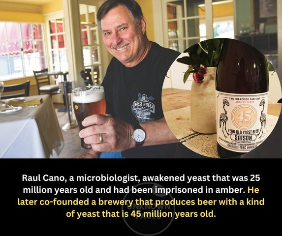

## The Topics

- The Brews
  - [Wegmans Organic Whole Bean Peruvian Decaf](https://shop.wegmans.com/product/218876/wegmans-organic-coffee-specialty-whole-bean-peruvian-decaf)
  - [Ferment Brewing Company El Lager Dorado](https://fermentbrewing.com/collections/beer/products/el-lager-dorado)
- The Hosts
  - Peter
  - Scott
- The podcast midlife crisis
  - 99 bottles of brew on the wall: 99 brews in 40 episodes
    - The Thumbs UP! brews
    - The Thumbs DOWN! brews
- Peter Rico: Peter goes to Puerto Rico
- Jurassic Beer

- AirPods Pro 2

## The Links

- [Wegmans Organic Whole Bean Peruvian Decaf](https://shop.wegmans.com/product/218876/wegmans-organic-coffee-specialty-whole-bean-peruvian-decaf)
- [Ferment Brewing Company El Lager Dorado](https://fermentbrewing.com/collections/beer/products/el-lager-dorado)
- [FriendsWBrews](https://appdot.net/@friendswbrews)
- [Friends With Brews Podcast](https://friendswithbrews.com)
