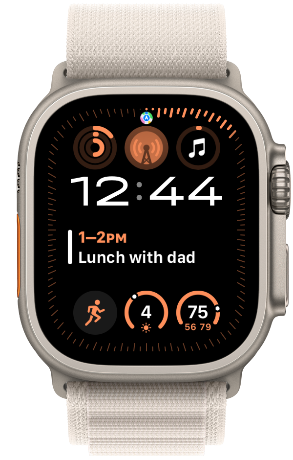
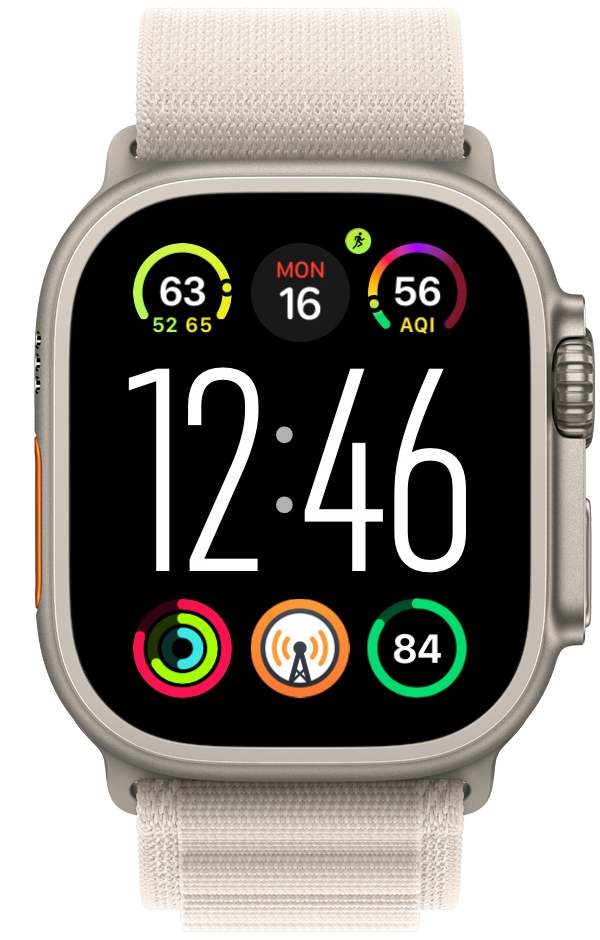
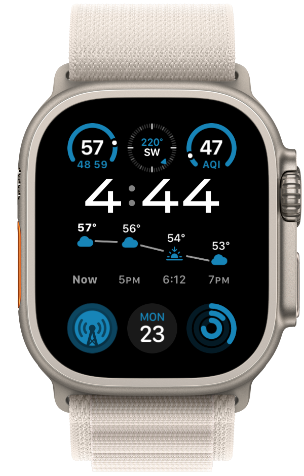

## The Topics

- The Brews
	- [Hacker-Pschorr Oktoberfest Märzen](https://www.hacker-pschorr.com/our-beers/usa/oktoberfest-maerzen)
	- [Three Creeks Brewing Fivepine Chocolate Porter](https://www.threecreeksbrewing.com/beer/)
	- [Dapper & Wise Roasters Highbrow Blend](https://dapperandwise.com/collections/coffee/products/highbrow-blend)
- Our watches – Apple Watch Ultra 2
	- [Apple Frames 3.1: Extending Screenshot Automation with the New Apple Frames API - MacStories](https://www.macstories.net/stories/apple-frames-3-1-extending-screenshot-automation-with-the-new-apple-frames-api/)
	- [Apple Frames shortcut](https://www.icloud.com/shortcuts/8655f2403d564658b32dcea409623479)
- [Speechify](https://speechify.com)
- The Weekly Planet and Big Sandwich
- [Number Go Up – Inside Crypto's Wild Rise and Staggering Fall](https://www.penguinrandomhouse.com/books/711959/number-go-up-by-zeke-faux/)

## The Links
- [Hacker-Pschorr Oktoberfest Märzen](https://www.hacker-pschorr.com/our-beers/usa/oktoberfest-maerzen)
- [Three Creeks Brewing Fivepine Chocolate Porter](https://www.threecreeksbrewing.com/beer/)
- [Dapper & Wise Roasters Highbrow Blend](https://dapperandwise.com/collections/coffee/products/highbrow-blend)
- [Apple Frames 3.1: Extending Screenshot Automation with the New Apple Frames API - MacStories](https://www.macstories.net/stories/apple-frames-3-1-extending-screenshot-automation-with-the-new-apple-frames-api/)
- [Apple Frames shortcut](https://www.icloud.com/shortcuts/8655f2403d564658b32dcea409623479)
- [Speechify](https://speechify.com)
- [Number Go Up – Inside Crypto's Wild Rise and Staggering Fall](https://www.penguinrandomhouse.com/books/711959/number-go-up-by-zeke-faux/)
- [FriendsWBrews](https://appdot.net/@friendswbrews)
- [Friends With Brews Podcast](https://friendswithbrews.com)
