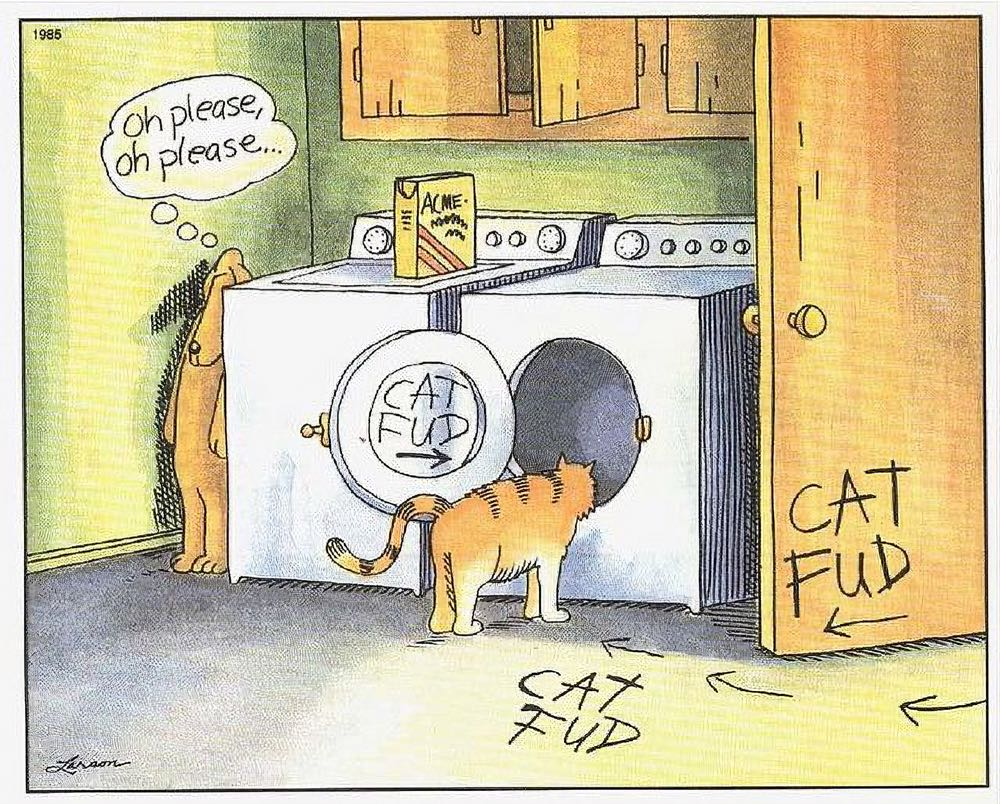

## The Topics

- The Brews
  - [Wegmans Decaf Colombian Whole Bean Coffee](https://shop.wegmans.com/product/228660/wegmans-decaf-colombian-whole-bean-coffee)
  - [Hopworks Brewery Beestly Organic Honey Porter](https://www.hopworksbeer.com/beer)
- Cat driers and other Far Sides

- Weekending in Vermont
- Beastly Organic Honey Porter review
- On the Virtues of Drinking Less
- Scott’s neighbor’s house – the downside to renting out a house
- Peter’s knee and other health fun
- Peter's 4k Monitor
- [Chicago](https://en.wikipedia.org/wiki/Chicago_%28typeface%29) – the Original Mac Font
- [Front and Center](https://apps.apple.com/us/app/front-and-center/id1493996622?mt=12) by John Siracusa
- Keychron Q1
- Mice and Trackpads
- Media moment – watching and reading and listening
  - [Sherlock Holmes and Count Dracula](https://en.wikipedia.org/wiki/Sherlock_Holmes_vs._Dracula)
- The automated Post Office sucks

## The Links

- [Wegmans Decaf Colombian Whole Bean Coffee](https://shop.wegmans.com/product/228660/wegmans-decaf-colombian-whole-bean-coffee)
- [Hopworks Brewery Beestly Organic Honey Porter](https://www.hopworksbeer.com/beer)
- [the far side cat drier cartoon at DuckDuckGo](https://duckduckgo.com/?q=the+far+side+cat+drier+cartoon&iax=images&ia=images&iar=images)
- [Chicago (typeface) - Wikipedia](https://en.wikipedia.org/wiki/Chicago_(typeface))
- [Hypercritical: Front and Center](https://hypercritical.co/2020/01/08/front-and-center)
- [Front and Center](https://apps.apple.com/us/app/front-and-center/id1493996622?mt=12) in the Mac App Store
- [Keychron Q1 QMK Custom Mechanical Keyboard - Version 2 – Keychron | Mechanical Keyboards for Mac, Windows and Android](https://www.keychron.com/products/keychron-q1)
- [Sherlock Holmes vs. Dracula - Wikipedia](https://en.wikipedia.org/wiki/Sherlock_Holmes_vs._Dracula)
- [FriendsWBrews](https://appdot.net/@friendswbrews)
- [Friends With Brews Podcast](https://friendswithbrews.com)
