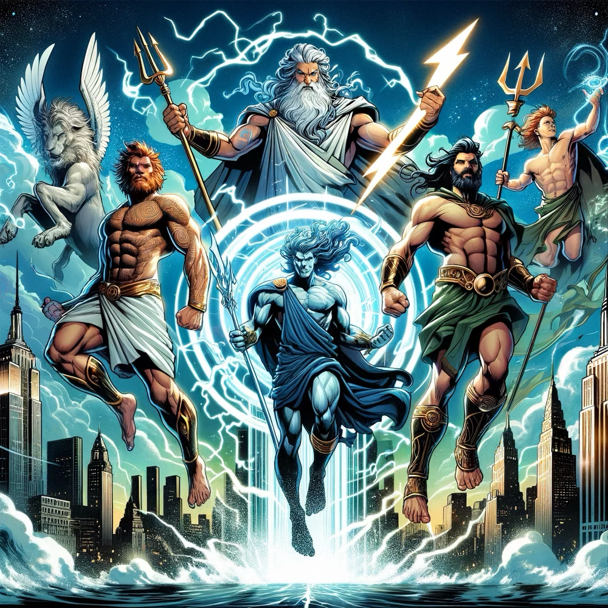

## The Topics

- The Brews
  - [Good Citizen Coffee Co Palmera](https://goodcitizencoffee.com/products/la-palmera?selling_plan=3114893464&variant=42499968565400)
  - [Wegmans Decaf Espresso Whole Bean Roast](https://shop.wegmans.com/product/109476/wegmans-decaf-espresso-whole-bean-coffee)
- Post-Covid brain fog?
- General quality of software is declining (?)
  - [Better Offline Podcast](https://www.iheart.com/podcast/139-better-offline-150284547/)
- Decaf coffee
  - [The Decaf Coffee Collection | Buy Decaf Online | Trade Coffee](https://www.drinktrade.com/collections/decaf-collection)
  - Accidental decaf drinkers
  - [Counter Culture Coffee Slow Motion – Decaf](https://counterculturecoffee.com/products/12-oz-slow-motion)
- Fitness updates
  - Scott’s stress fracture (maybe?)
  - [Altra Escalante 3](https://www.altrarunning.com/shop/mens-escalante-3-al0a7r6m)
  - Peter runs again!
- Ugh, the Savage Worlds Orc
- Scott’s Notion update
  - Notion is great for documentation
    - It doesn’t insist on using Markdown for something that’s never going to leave Notion or get published
    - Markdown is GREAT for portability but SUCKS for the writing experience and sometimes even the note reading experience
- AI updates
  - ChatGPT vs Claude
  - Dall-E image generation
    - Peter’s game images
    - Is AI art going to destroy the universe for artists?

  
  
  
  
  
  
  
  
  

## The Links

- [Good Citizen Coffee Co Palmera](https://goodcitizencoffee.com/products/la-palmera?selling_plan=3114893464&variant=42499968565400)
- [Wegmans Decaf Espresso Whole Bean Roast](https://shop.wegmans.com/product/109476/wegmans-decaf-espresso-whole-bean-coffee)
- [Better Offline | iHeart](https://www.iheart.com/podcast/139-better-offline-150284547/)
- [The Decaf Coffee Collection | Buy Decaf Online | Trade Coffee](https://www.drinktrade.com/collections/decaf-collection)
- [Slow Motion – Decaf – Counter Culture Coffee](https://counterculturecoffee.com/products/12-oz-slow-motion)
- [Men's Escalante 3— A Refresh to a Classic Road Running Shoe. | Altra Running](https://www.altrarunning.com/shop/mens-escalante-3-al0a7r6m)
- [H.V.M.N. — Health Via Modern Nutrition](https://hvmn.com/)
- [FriendsWBrews](https://appdot.net/@friendswbrews)
- [Friends With Brews Podcast](https://friendswithbrews.com)
